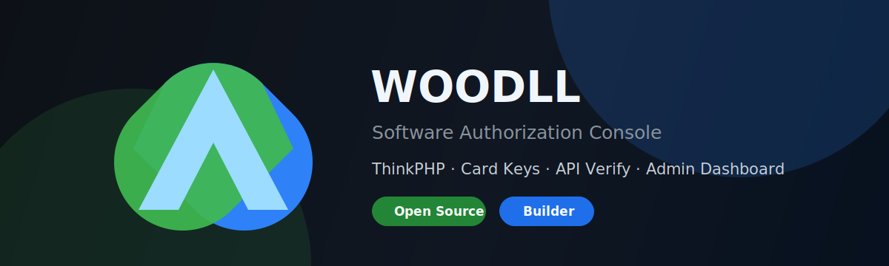

<div align="center">



### 独立开发者 / PHP & ThinkPHP / Web Console Builder

把软件授权、卡密验证、后台控制台和部署流程做得更清晰、更稳定、更好用。

<p>
  <a href="https://github.com/likew1nd/Woodll-App">
    
  </a>
  
  
  
  
</p>

<p>
  <a href="https://github.com/likew1nd/Woodll-App">Project</a>
  ·
  <a href="https://github.com/likew1nd/Woodll-App/releases/tag/v1.0.0">Release</a>
  ·
  <a href="https://github.com/likew1nd?tab=repositories">Repositories</a>
</p>

</div>

---

## About

我主要关注 Web 后台、软件授权、卡密系统、用户体系、接口验证、支付配置和轻量化安装部署。  
喜欢把复杂业务拆成可维护的模块，再打磨成可以直接交付的产品。

```text
Backend      PHP, ThinkPHP, REST-style APIs
Database     MySQL
Frontend     HTML, CSS, JavaScript, Bootstrap, Layui, Vue
Deploy       Nginx, Apache, BaoTa Panel, GitHub Releases
Focus        Authorization, Card Keys, Admin Console, Install Wizard
```

## Featured

<table>
  <tr>
    <td width="50%">
      <h3>WOODLL App</h3>
      <p>基于 ThinkPHP 8 的授权管理与后台控制台系统，包含安装向导、后台登录、软件管理、卡密管理、用户管理、接口验证和支付配置。</p>
      <p>
        <a href="https://github.com/likew1nd/Woodll-App">Repository</a>
        ·
        <a href="https://github.com/likew1nd/Woodll-App/releases/tag/v1.0.0">Download</a>
      </p>
    </td>
    <td width="50%">
      <h3>Woodll Tools</h3>
      <p>基于 IT Tools 二次开发的开源工具箱，面向日常开发、运维和效率场景。</p>
      <p>
        <a href="https://github.com/likew1nd/Woodll-Tools">Repository</a>
      </p>
    </td>
  </tr>
</table>

## What I Build

- 授权管理系统：卡密、用户、版本、接口验证和业务配置。
- 后台控制台：清晰的管理入口、数据列表、记录查询和配置面板。
- 安装部署体验：网页安装向导、环境配置、伪静态说明和 Release 安装包。
- 项目本地化：中文化、界面优化、默认主题调整和使用体验改进。

## GitHub

<div align="center">


</div>

---

<div align="center">

**Building practical tools, one clean release at a time.**

</div>
